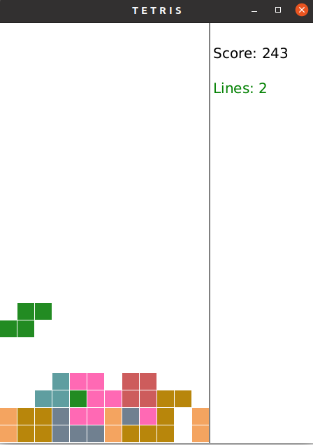

# gaspar_Tetris

First program with JavaFX, written with this tutorial: https://www.youtube.com/watch?v=boAJUSN8fOU.
Original code is here: https://github.com/Gaspared/tetris

Introduced many alterations to code to make it cleaner:

<ul>
<li>domain objects are referenced by interfaces (Shape, Square)</li>
<li>removed many reduntant statements</li>
<li>methods are smaller with single responsibility</li>
</ul>

